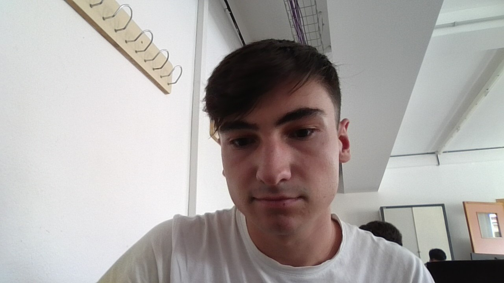

# ¡Hola, soy Raúl!

## Sobre mí
Soy Raúl Sereno Cambrón, tengo 18 años y vivo aqui en Fátima, me he metido a este ciclo porque me gustan mucho los ordenadores y estoy todo le día usandolo. La razón principal de proque estoy aquí es porque quiero aprender como funcioonan los ordenadores y esas mas cosas relacionadas con este mundillo.

### Hobbies
- **Pádel:** soy un apasionado a ese deporte ya que llevo jugando 12 años y no tengo pensado dejarlo nunca, juego a un muy buen nivel y he llegado a ganar algunos torneos, aunque no profesionales claro
- **Videojuegos:** prácticamente casi todas las tardes las dedico a jugar videojuegos en mi ordenador de sobremesa
- **Netflix:** también dedico una parte del día a ver serie o películas; ahora estoy viendo una serie larga pero muy interesante que es *Prison Break*
- **Deporte:** a parte de jugar a pádel tambien hago más deporte como ir al gymnasio o a veces juego a tenis y fútbol, por lo que me considero una persona bastante activa en los deportes.

### Educación
- Vengo de hacer Bachillerato Tecnológico en este centro y también llevo aqui toda la eso
- La primaria e infantil lo hize en el colegio *Concepción Arenal*

### Contacto
- **Correo electrónico personal:** raulsereno06@gmail.com  
-  **Correo electrónico corporativo:** a18secara@iesgrancapitan.org

### Una foto mía

